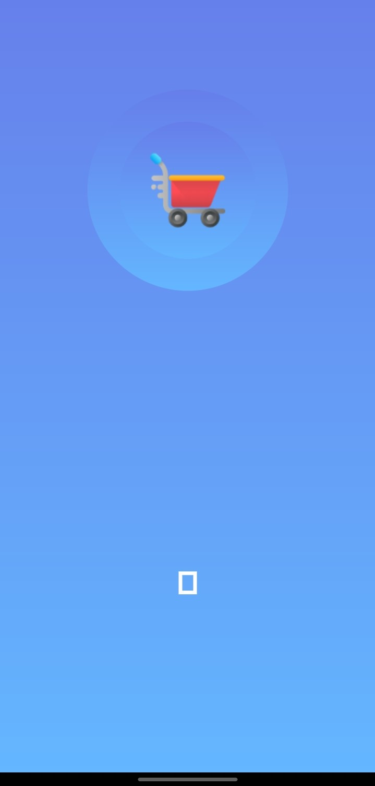
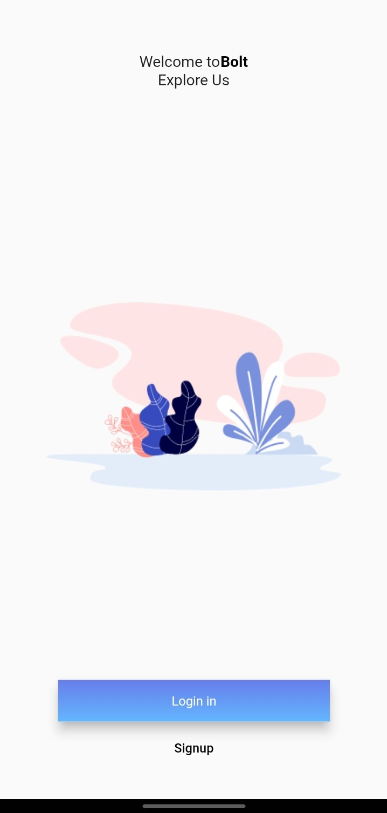
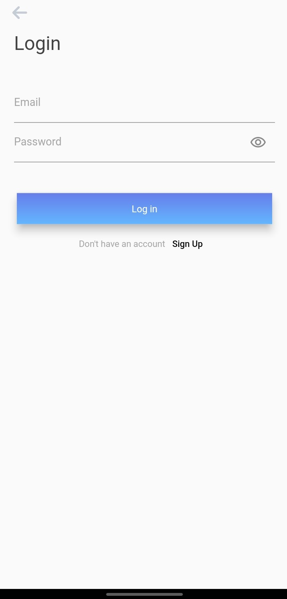
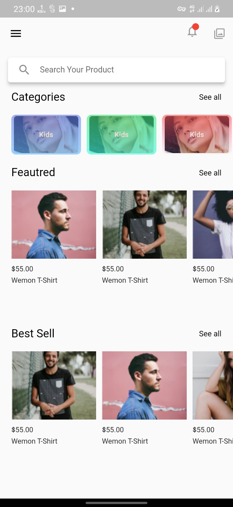
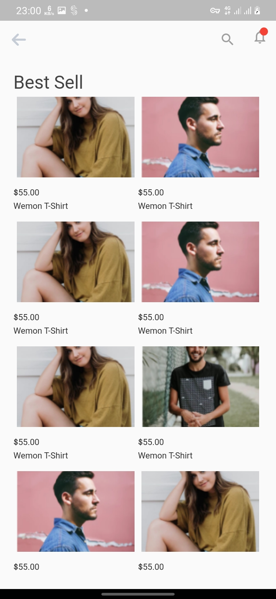
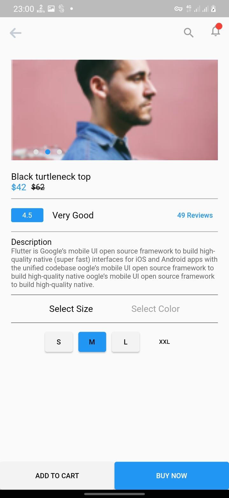

## Flutter e-commerce Application UI Design 

## Project :
- **State Mangment**: Bloc 
- ** Screens **
- *Android & IOS*
<br>

## Development Setup
Clone the repository and run the following commands:
```
flutter pub get
flutter run
```

## ScreenShot

&nbsp;&nbsp;&nbsp;
<br>
&nbsp;&nbsp;&nbsp;&nbsp;

## Links

* [Twitter](https://twitter.com/ig_ayoub)
* [Email](igayoub33@gmail.com)
> IG AYOUB Dev
